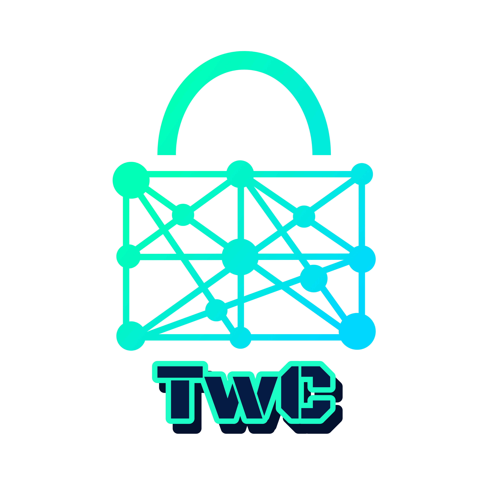

<h1 align="center">HELM <a href="https://github.com/jimouris/helm/blob/main/LICENSE"></a> </h1>

<h2 align="center">HELM: Homomorphic Evaluation with Lookup table Memoization</h2>


## Overview
HELM is a framework for evaluating synthesizable HDL designs in the encrypted 
domain that is designed for multi-core CPU evaluation. Users can choose between
evaluating circuits composed of standard Boolean gates or low-precision LUTs. In 
either case, both sequential and combinational circuits are supported. 

```shell
cargo build --release
cargo test --release
cargo run --bin preprocessor -- --input ./verilog-files/netlists/s27.v
cargo run --bin helm --release -- --input ./verilog-files/netlists/s27.out.v
cargo run --bin helm --release -- --input ./verilog-files/netlists/2bit_adder.v --wires ./verilog-files/inputs/2bit_adder.input.csv
```

<p align="center">
    
</p>
<h4 align="center">Trustworthy Computing Group</h4>
